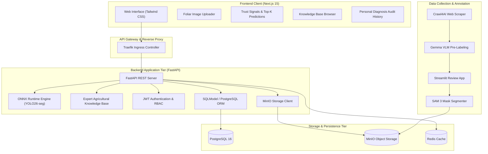
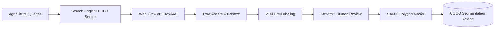

# End-to-End Instance Segmentation System for Coffee and Rice Leaf Disease Diagnosis

An end-to-end Machine Learning system employing **Instance Segmentation** to diagnose foliar diseases and deliver actionable agronomic treatment recommendations for Vietnam's specialty agricultural crops (Rice and Coffee).

The system encompasses the complete machine learning engineering lifecycle: automated web data collection, Vision-Language Model (VLM) pre-labeling with human-in-the-loop validation, Segment Anything Model (SAM 3) mask generation, multi-architecture deep learning benchmarking across three representative paradigms (**YOLO26-seg**, **RF_DETR**, and **Mask R-CNN**), Joint Multi-Domain fine-tuning, ONNX Runtime CPU serving with INT8 quantization, and cloud-native deployment on K3s/Kubernetes.
---

## 1. System Architecture



---

## 2. Key Features

- **Real-Time Foliar Instance Segmentation:** Evaluates high-resolution leaf images using an optimized **YOLO26-seg (ONNX runtime)** model, delivering precise lesion boundary detection and class identification with low latency (~205 ms on standard CPU at full $1024 \times 1024$ native resolution).
- **Expert Agricultural Knowledge Base:** Integrated rule-based disease advisory covering 7 distinct foliar disease pathologies plus asymptomatic healthy controls across rice and coffee. Provides immediate etiology, typical symptoms, chemical/biological remedies, and preventive agronomic practices.
- **Advanced Automated Dataset Pipeline:** High-throughput scraping via [Crawl4AI](https://github.com/unclecode/crawl4ai) and DuckDuckGo/Serper, automated candidate pre-labeling using Vision-Language Models, polygon mask synthesis with **SAM 3 (Segment Anything Model)**, and human verification through an in-house Streamlit application.
- **Modern Cloud-Native Backend:** FastAPI asynchronous server with SQLModel/PostgreSQL persistence for user accounts and audit logging, MinIO S3-compatible storage for raw and annotated imagery, and Redis for caching.
- **Accessible International Frontend:** Responsive Next.js 15 (App Router) interface built with Tailwind CSS, supporting drag-and-drop uploads, mobile camera captures, Top-K confidence metrics, and bilingual disease data.
- **DevOps & Quality Engineering:** Docker Compose for local orchestration, Helm charts for K3s lightweight Kubernetes deployments, comprehensive Pytest unit/integration test suites, and Locust load testing.

---

## 3. Disease Taxonomy & Conditions

The system identifies 7 primary foliar diseases affecting Vietnamese agriculture alongside asymptomatic healthy foliage as a negative control:

| Crop | Condition Label | Scientific / English Name | Vietnamese Name | Pathological Severity |
|:---|:---|:---|:---|:---:|
| **Rice** | `Healthy` | Healthy Rice Leaf | Lá lúa khỏe mạnh | Asymptomatic Control |
| **Rice** | `BrownSpot` | Rice Brown Spot (*Bipolaris oryzae*) | Bệnh đốm nâu hại lúa | Medium |
| **Rice** | `LeafBlast` | Rice Leaf Blast (*Magnaporthe oryzae*) | Bệnh đạo ôn lá lúa | High |
| **Rice** | `Hispa` | Rice Hispa (*Dicladispa armigera*) | Bọ gai / Sâu gai hại lúa | Medium |
| **Coffee** | `LeafMiner` | Coffee Leaf Miner (*Leucoptera coffeella*) | Sâu vẽ bùa hại lá cà phê | Medium |
| **Coffee** | `PowderyMildew` | Coffee Powdery Mildew (*Oidium erysiphoides*) | Bệnh phấn trắng cà phê | Medium |
| **Coffee** | `Rust` | Coffee Leaf Rust (*Hemileia vastatrix*) | Bệnh gỉ sắt cà phê | High |
| **Coffee** | `AlgalLeafSpot` | Algal Leaf Spot (*Cephaleuros virescens*) | Bệnh đốm rong cà phê | Medium |
---

## 4. Dataset Pipeline & Annotation

The data construction workflow combines automated VLM filtering and human verification to generate leakage-free COCO instance segmentation datasets:



For complete instructions on executing the 6-step dataset pipeline, see [`docs/DATASET_PIPELINE.md`](docs/DATASET_PIPELINE.md).

---

## 5. Model Architecture & Benchmarks

The project benchmarks three representative instance segmentation model families:
1. **YOLO26-seg (Real-Time Single-Stage CNN)**: Anchor-free C3k2 backbone with prototype mask representations for low-latency edge serving.
2. **RF_DETR (Query-Based Vision Transformer)**: DINO-DETR query segmentation architecture with bipartite Hungarian matching.
3. **Mask R-CNN (Canonical Two-Stage Baseline)**: ResNet-50-FPN backbone with Region Proposal Network (RPN) and RoIAlign mask head.

### 5.1. YOLO26-seg Strategy: Joint Multi-Domain vs. Separated

Prior to cross-architecture benchmarking, two fine-tuning configurations were evaluated for YOLO26-seg on the leakage-free `coffee_rice_v002` split:
- **Separated Models**: Independent domain-specific networks for Coffee (4 classes) and Rice (3 classes) requiring an upstream crop classifier.
- **Joint Multi-Domain Model**: Single consolidated network trained across all 7 classes simultaneously.

**Empirical Strategy Comparison (Held-Out Test Set, $N = 648$):**
- **Cross-Domain Feature Transfer**: Co-training exposed early convolutional layers to diverse plant textures and lesion margins, producing a **+0.1216 gain** in Rice Mask $mAP@50$ ($0.3587 \to 0.4803$, relative $+33.9\%$) and a **2.5-fold increase** on `Hispa` ($0.1731 \to 0.4388$, $\Delta = +0.2657$). Coffee performance remained stable ($0.7281 \to 0.7194$, retaining $98.8\%$ baseline performance).
- **False-Positive Suppression**: The background clean rate ($BCR$) on asymptomatic healthy control leaves improved from $50.48\%$ to **$80.29\%$** ($\Delta = +29.81\text{ pp}$), suppressing false detections on normal leaf veins.
- **Operational Simplicity**: The unified model requires only a single 11.0 MB ONNX graph in memory (50% RAM reduction vs. serving two 11.0 MB models) and completely eliminates upstream crop-classifier routing errors.

### 5.2. Comparative Architecture Benchmark on Held-Out Test Set ($N = 648$)

| Architecture | Paradigm | Mask mAP@50 | Mask mAP@50:95 | Box mAP@50 | mIoU | Dice | Background Clean Rate | CPU Latency ($1024^2$) | Checkpoint Size |
| :--- | :--- | :---: | :---: | :---: | :---: | :---: | :---: | :---: | :---: |
| **YOLO26n-seg (Joint)** | Single-Stage CNN | **0.6169** | **0.6106** | **0.6169** | **0.6986** | **0.8155** | **80.29%** | **~205 ms** | **11.0 MB (ONNX)** |
| **RF_DETR** | Query Transformer | — | — | — | — | — | — | — | — |
| **Mask R-CNN** | Two-Stage CNN | — | — | — | — | — | — | — | — |

*Note: Results for RF_DETR and Mask R-CNN will be incorporated upon completion of ongoing Kaggle training runs. For comprehensive methodology, granular class breakdowns, and serving specifications, see [`docs/MODEL_SELECTION_REPORT.md`](docs/MODEL_SELECTION_REPORT.md).*
---
## 6. Quick Start Guide

### Prerequisites
- Python 3.12+
- Node.js 20+ and npm
- Docker and Docker Compose

### 1. Start Infrastructure Services
Start PostgreSQL, MinIO, and Redis in the background:
```bash
docker compose up -d postgres minio redis
```

### 2. Backend Setup
```bash
# Install backend dependencies
uv sync

# Run database migrations
uv run alembic -c backend/alembic.ini upgrade head

# Start FastAPI development server
uv run uvicorn backend.app.main:app --host 0.0.0.0 --port 8000 --reload
```
Interactive OpenAPI documentation will be available at `http://localhost:8000/docs`.

### 3. Frontend Setup
```bash
cd frontend
npm install
npm run dev
```
Open `http://localhost:3000` in your browser.

---

## 7. Testing & Verification

Run the automated test suites:

```bash
# Python backend, crawler, and dataset validation tests
uv run pytest tests/ -v

# Frontend component and integration tests
cd frontend && npm test -- --run
```
