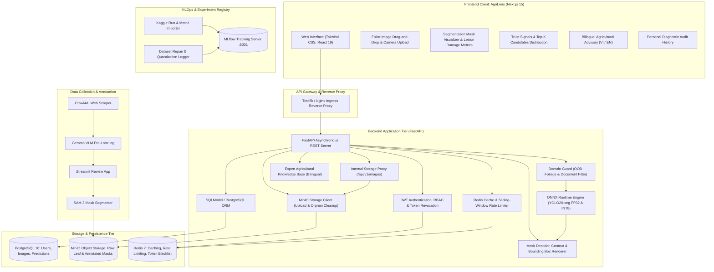
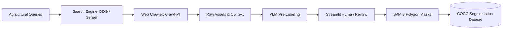

# End-to-End Instance Segmentation System for Coffee and Rice Leaf Disease Diagnosis

[](https://agrilens-ai.duckdns.org)
[](https://api.agrilens-ai.duckdns.org/docs)
[](https://mlflow.agrilens-ai.duckdns.org)
[](k8s/README.md)
[](https://www.python.org/)
[](https://nextjs.org/)

An end-to-end Machine Learning system employing **Instance Segmentation** to diagnose foliar diseases and deliver actionable agronomic treatment recommendations for Vietnam's specialty agricultural crops (Rice and Coffee).

The system encompasses the complete machine learning engineering lifecycle: automated web data collection, Vision-Language Model (VLM) pre-labeling with human-in-the-loop validation, Segment Anything Model (SAM 3) mask generation, multi-architecture deep learning benchmarking across three representative paradigms (**YOLO26-seg**, **RF_DETR**, and **Mask R-CNN**), Joint Multi-Domain fine-tuning, ONNX Runtime CPU serving with INT8 quantization, and cloud-native deployment on K3s/Kubernetes.

---

## 🌐 Live Production Deployment & Public Endpoints

The complete AgriLens ecosystem is deployed on a **K3s (Kubernetes) cluster hosted on AWS EC2** with Traefik Ingress Controller and automated Let's Encrypt SSL/TLS certificates. Recruiters and technical evaluators can access and inspect each service live:

| Service | Public Domain URL | Access | Purpose & Key Features |
| :--- | :--- | :---: | :--- |
| **AgriLens Web Application** | [**`agrilens-ai.duckdns.org`**](https://agrilens-ai.duckdns.org) | *Public* | **Next.js 15 Web UI**: Real-time foliar leaf diagnosis, interactive segmentation mask slider, lesion count & damage surface metrics, top-3 candidate confidence distribution, and bilingual agronomic advisory (VI/EN). |
| **FastAPI REST API & Swagger** | [**`api.agrilens-ai.duckdns.org/docs`**](https://api.agrilens-ai.duckdns.org/docs) | *Public* | **Interactive Swagger UI**: Live API testbed, OpenAPI schema, ReDoc documentation at [`/redoc`](https://api.agrilens-ai.duckdns.org/redoc), and service health probes at [`/health`](https://api.agrilens-ai.duckdns.org/health). |
| **MLflow Tracking Server** | [**`mlflow.agrilens-ai.duckdns.org`**](https://mlflow.agrilens-ai.duckdns.org) | *Public* | **MLOps Experiment Dashboard**: Multi-architecture benchmark runs (YOLO26-seg, RF_DETR, Mask R-CNN), training telemetry, PR curves, dataset audit logs, and INT8 quantization benchmarks. |
| **MinIO S3 Storage Console** | [**`storage.agrilens-ai.duckdns.org`**](https://storage.agrilens-ai.duckdns.org) | *Admin* | **Object Storage Console**: Cloud-native S3 storage management for raw agricultural leaf uploads, annotated segmentation masks, and model weights. |

> 💡 **Same-Origin API Routing:** In addition to the dedicated API subdomain, the backend is also routed via same-origin reverse proxy at [`https://agrilens-ai.duckdns.org/api`](https://agrilens-ai.duckdns.org/api) to eliminate CORS overhead for client web applications.

### 🧪 Quick Evaluation Guide for Reviewers & Recruiters

Reviewers can verify model accuracy, edge serving latency, and domain guard robustness in 3 quick ways:

1. **Interactive Web Testing**:
   - Navigate to [https://agrilens-ai.duckdns.org](https://agrilens-ai.duckdns.org).
   - Drag & drop or upload any coffee or rice leaf image (sample test images are available in [`artifacts/yolo26_seg_joint/label_qa/`](artifacts/yolo26_seg_joint/label_qa/)).
   - Toggle the segmentation overlay slider to inspect precise lesion contours, affected surface area percentage, and treatment suggestions.
   - **Out-of-Distribution (OOD) Test:** Upload a non-leaf specimen (e.g. document, face, flower) to see the Domain Guard reject false positives with zero hallucination.
2. **Direct API Inference (`curl` or Swagger UI)**:
   ```bash
   curl -X POST "https://api.agrilens-ai.duckdns.org/api/v1/predict" \
     -H "accept: application/json" \
     -F "file=@artifacts/yolo26_seg_joint/label_qa/coffee_coffee_0006450.jpg"
   ```
3. **MLOps & Experiment Verification**:
   - Open [https://mlflow.agrilens-ai.duckdns.org](https://mlflow.agrilens-ai.duckdns.org) to inspect live experiment parameters, mAP metrics, Precision-Recall curves, and INT8 quantization comparison runs.

---

## 1. System Architecture



---

## 2. Key Features

- **Real-Time Foliar Instance Segmentation & Visualization:** Evaluates high-resolution leaf images at $1024 \times 1024$ native resolution using an optimized **YOLO26-seg (ONNX runtime)** model. Automatically renders lesion contours, bounding boxes, and transparent colored overlays, returning lesion counts, damage surface area percentages, and annotated image URLs.
- **Domain Guard & Out-of-Distribution (OOD) Protection:** Incorporates computer vision heuristics (HSV saturation/hue and stroke density analysis) to identify out-of-domain uploads (e.g. certificates, scanned documents, human faces, or non-plant objects). Rejects spurious predictions early and displays localized advisory warnings without generating hallucinations.
- **Zero-Exposure Storage Architecture (Image Proxy):** Serves uploaded and annotated segmentation imagery directly via `/api/v1/images/{object_key}` backend proxy, keeping MinIO S3 object storage completely private within internal cluster networks.
- **INT8 CPU Serving Optimization:** Post-training dynamic INT8 quantization reduces model disk size from **10.82 MB down to 3.77 MB (2.87x compression)** and cuts 2-vCPU latency down to **~163 ms** while preserving high mask fidelity (0.988 cosine similarity, 0.847 Dice score).
- **Redis Caching & Sliding-Window Rate Limiting:** High-throughput Redis integration providing 3600s TTL caching for agricultural knowledge base lookups, sliding-window rate limiting (30 requests/minute on prediction, 10 requests/minute on authentication), and immediate JWT token blacklisting on logout.
- **Centralized MLOps with MLflow:** Experiment tracking server on port `5001` logging multi-architecture benchmarks (YOLO26-seg, RF_DETR, Mask R-CNN), hyperparameter sweeps, epoch-by-epoch loss/mAP curves, dataset repair audits (v001 to v002), and quantization metrics.
- **Bilingual Agronomic Knowledge Base:** Comprehensive disease etiology, symptomology, agronomic treatments, and preventive practices in both **Vietnamese** and **English**, calibrated with diagnostic confidence notes.
- **AgriLens Modern Frontend (Next.js 15):** Responsive interface featuring interactive toggle between original and segmented masks, Top-3 candidate distribution, close-margin alerts, OOD specimen warnings, collapsible navigation, and mobile camera support.
- **Cloud-Native Deployment Ready:** Complete Docker Compose stack for single-node AWS EC2 deployment, production Kubernetes/K3s manifests (`k8s/`) with Traefik Ingress & Let's Encrypt SSL, Helm charts, automated Alembic migrations, and full Pytest/Vitest verification suites.
## 3. Disease Taxonomy & Conditions

The system identifies 7 primary foliar diseases affecting Vietnamese agriculture alongside asymptomatic healthy foliage as a negative control:

| Crop | Condition Label | Scientific / English Name | Vietnamese Name | Pathological Severity |
|:---|:---|:---|:---|:---:|
| **Rice** | `Healthy` | Healthy Rice Leaf | Lá lúa khỏe mạnh | Asymptomatic Control |
| **Rice** | `BrownSpot` | Rice Brown Spot (*Bipolaris oryzae*) | Bệnh đốm nâu hại lúa | Medium |
| **Rice** | `LeafBlast` | Rice Leaf Blast (*Magnaporthe oryzae*) | Bệnh đạo ôn lá lúa | High |
| **Rice** | `Hispa` | Rice Hispa (*Dicladispa armigera*) | Bọ gai / Sâu gai hại lúa | Medium |
| **Coffee** | `LeafMiner` | Coffee Leaf Miner (*Leucoptera coffeella*) | Sâu vẽ bùa hại lá cà phê | Medium |
| **Coffee** | `PowderyMildew` | Coffee Powdery Mildew (*Oidium erysiphoides*) | Bệnh phấn trắng cà phê | Medium |
| **Coffee** | `Rust` | Coffee Leaf Rust (*Hemileia vastatrix*) | Bệnh gỉ sắt cà phê | High |
| **Coffee** | `AlgalLeafSpot` | Algal Leaf Spot (*Cephaleuros virescens*) | Bệnh đốm rong cà phê | Medium |
---

## 4. Dataset Pipeline & Annotation

The data construction workflow combines automated VLM filtering and human verification to generate leakage-free COCO instance segmentation datasets:



For complete instructions on executing the 6-step dataset pipeline, see [`docs/DATASET_PIPELINE.md`](docs/DATASET_PIPELINE.md).

---

## 5. Model Architecture & Benchmarks

The project benchmarks three representative instance segmentation model families:
1. **YOLO26-seg (Real-Time Single-Stage CNN)**: Anchor-free C3k2 backbone with prototype mask representations for low-latency edge serving.
2. **RF_DETR (Query-Based Vision Transformer)**: DINO-DETR query segmentation architecture with bipartite Hungarian matching.
3. **Mask R-CNN (Canonical Two-Stage Baseline)**: ResNet-50-FPN backbone with Region Proposal Network (RPN) and RoIAlign mask head.

### 5.1. YOLO26-seg Strategy: Joint Multi-Domain vs. Separated

Prior to cross-architecture benchmarking, two fine-tuning configurations were evaluated for YOLO26-seg on the leakage-free `coffee_rice_v002` split:
- **Separated Models**: Independent domain-specific networks for Coffee (4 classes) and Rice (3 classes) requiring an upstream crop classifier.
- **Joint Multi-Domain Model**: Single consolidated network trained across all 7 classes simultaneously.

**Empirical Strategy Comparison (Held-Out Test Set, $N = 648$):**
- **Cross-Domain Feature Transfer**: Co-training exposed early convolutional layers to diverse plant textures and lesion margins, producing a **+0.1216 gain** in Rice Mask $mAP@50$ ($0.3587 \to 0.4803$, relative $+33.9\%$) and a **2.5-fold increase** on `Hispa` ($0.1731 \to 0.4388$, $\Delta = +0.2657$). Coffee performance remained stable ($0.7281 \to 0.7194$, retaining $98.8\%$ baseline performance).
- **False-Positive Suppression**: The background clean rate ($BCR$) on asymptomatic healthy control leaves improved from $50.48\%$ to **$80.29\%$** ($\Delta = +29.81\text{ pp}$), suppressing false detections on normal leaf veins.
- **Operational Simplicity**: The unified model requires only a single 11.0 MB ONNX graph in memory (50% RAM reduction vs. serving two 11.0 MB models) and completely eliminates upstream crop-classifier routing errors.

### 5.2. Comparative Architecture Benchmark on Held-Out Test Set ($N = 648$)
| Architecture | Paradigm | Mask mAP@50 | Mask mAP@50:95 | Box mAP@50 | mIoU | Dice | Background Clean Rate | CPU Latency ($1024^2$) | Checkpoint Size |
| :--- | :--- | :---: | :---: | :---: | :---: | :---: | :---: | :---: | :---: |
| **YOLO26n-seg (Joint FP32)** | Single-Stage CNN | **0.6169** | **0.6106** | **0.6169** | **0.6986** | **0.8155** | **80.29%** | **~202 ms (2 vCPU)** | **10.82 MB (ONNX)** |
| **YOLO26n-seg (Joint INT8)** | Single-Stage CNN | **0.6085** | **0.6022** | **0.6110** | **0.8060** | **0.8467** | **80.29%** | **~163 ms (2 vCPU)** | **3.77 MB (ONNX)** |
| **RF_DETR** | Query Transformer | — | — | — | — | — | — | — | — |
| **Mask R-CNN** | Two-Stage CNN | — | — | — | — | — | — | — | — |

*Note: For complete quantization methodology, proto preservation rationale, and serving contracts, see [`docs/QUANTIZATION_REPORT.md`](docs/QUANTIZATION_REPORT.md). For detailed architecture selection trade-offs, see [`docs/MODEL_SELECTION_REPORT.md`](docs/MODEL_SELECTION_REPORT.md).*

---

## 6. Quick Start Guide

### Prerequisites
- Python 3.12+ (managed with `uv`)
- Node.js 20+ and npm
- Docker and Docker Compose (v2.20+)

### Option A: Complete Docker Compose Stack (Recommended)

```bash
# 1. Clone repository and initialize environment variables
cp .env.example .env

# 2. Launch all services (Frontend, Backend, PostgreSQL, Redis, MinIO, MLflow)
docker compose up -d --build
```

#### Service Endpoints:
| Service | URL | Default Credentials | Description |
| :--- | :--- | :--- | :--- |
| **AgriLens Web App** | `http://localhost:3000` | — | Next.js 15 UI with segmentation viewer |
| **FastAPI Backend & Docs** | `http://localhost:8000/docs` | — | OpenAPI Swagger documentation |
| **MLflow Tracking UI** | `http://localhost:5001` | — | Experiment runs, curves, and artifacts |
| **MinIO Storage Console** | `http://localhost:9001` | `minioadmin` / `minioadmin` | S3 image bucket management |
| **PostgreSQL Database** | `localhost:5433` | `admin` / `changeme` (db: `plant_disease`) | Relational data persistence |
| **Redis Cache & Limiter** | `localhost:6379` | — | In-memory cache and rate limiting |

### Option B: Local Development Workflow

```bash
# 1. Start persistence and tracking infrastructure
docker compose up -d postgres redis minio mlflow

# 2. Backend setup and migrations
uv sync
uv run alembic -c backend/alembic.ini upgrade head
uv run uvicorn backend.app.main:app --host 0.0.0.0 --port 8000 --reload

# 3. Frontend setup
cd frontend
npm install
npm run dev
```

### Option C: Production Kubernetes / K3s Cluster (`k8s/`)

For production deployments on AWS EC2 or bare-metal Kubernetes using K3s with Traefik Ingress and automated Let's Encrypt SSL:

```bash
# 1. Initialize namespace and secret definitions
kubectl apply -f k8s/namespace.yaml
kubectl apply -f k8s/secrets.yaml
kubectl apply -f k8s/pvc.yaml

# 2. Deploy persistence & MLOps infrastructure (Postgres, Redis, MinIO, MLflow)
kubectl apply -f k8s/postgres.yaml
kubectl apply -f k8s/redis.yaml
kubectl apply -f k8s/minio.yaml
kubectl apply -f k8s/mlflow.yaml

# 3. Deploy AgriLens application tier (Backend & Frontend)
kubectl apply -f k8s/backend.yaml
kubectl apply -f k8s/frontend.yaml

# 4. Configure Ingress routing & TLS Certificate Issuer (DuckDNS / Let's Encrypt)
kubectl apply -f k8s/cluster-issuer.yaml
kubectl apply -f k8s/ingress.yaml
```

#### Production Cluster Ingress Endpoints:
| Service | Domain Endpoint | Target Workload | Description |
| :--- | :--- | :--- | :--- |
| **AgriLens Web UI** | `https://agrilens-ai.duckdns.org` | `frontend:3000` | Main diagnostic web application |
| **Same-Origin API** | `https://agrilens-ai.duckdns.org/api` | `backend:8000` | Same-origin API routing (eliminates CORS) |
| **Dedicated REST API** | `https://api.agrilens-ai.duckdns.org` | `backend:8000` | Standalone REST API & Swagger UI (`/docs`, `/redoc`) |
| **MLflow Tracking UI** | `https://mlflow.agrilens-ai.duckdns.org` | `mlflow:5000` | Experiment tracking & model registry |
| **MinIO S3 Console** | `https://storage.agrilens-ai.duckdns.org` | `minio:9001` | S3 object storage management console |

For in-depth Kubernetes architecture details, persistent volume configurations, and custom domain setup, refer to [`k8s/README.md`](k8s/README.md).

### 6.1. Logging Experiments & Benchmarks to MLflow

Once the MLflow service is running (`http://localhost:5001`), populate experiment tracking records:

```bash
# Import Kaggle training runs, parameters, metrics, and PR curves
uv run python scripts/import_experiments_to_mlflow.py --tracking-uri http://localhost:5001

# Log dataset engineering audits (v001 -> v002) and INT8 quantization benchmarks
uv run python scripts/log_mlflow_pipeline.py --tracking-uri http://localhost:5001
```

### 6.2. Production AWS EC2 Deployment

For step-by-step guidance on provisioning an AWS EC2 instance (Ubuntu 24.04), configuring Security Groups, environment variables, Nginx reverse proxy, and Let's Encrypt SSL, refer to the [AWS EC2 Production Deployment Guide](docs/DEPLOYMENT_EC2.md).

---

## 7. Testing & Quality Verification

Run the automated test suites to ensure system integrity:

```bash
# Python backend, rate limiting, caching, and inference tests
uv run pytest tests/ -v

# Frontend component and UI integration tests
cd frontend && npm test -- --run
```
