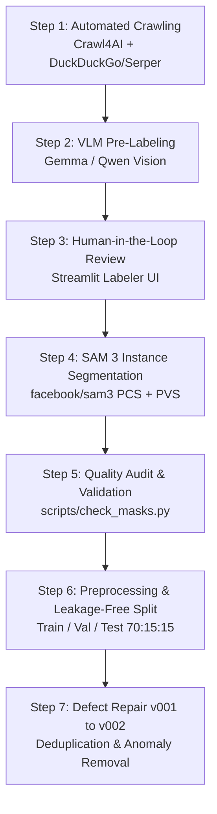

# Dataset Construction and Annotation Pipeline

This document describes the end-to-end data pipeline used to create, annotate, segment, validate, and preprocess the leaf disease datasets for Coffee and Rice crops.



---

## 1. Automated Web Crawling & Asset Collection

The crawler discovers agricultural articles, field guides, and plant pathology blog posts using parameterized domain queries.

### CLI Usage

```bash
# Run crawler for all crops with default DuckDuckGo search
python -m crawl.pipeline --crop all

# Run dry-run to preview search queries and output paths without network calls
python -m crawl.pipeline --crop coffee --dry-run

# Scrape using Serper.dev API for high-throughput searches
python -m crawl.pipeline --crop rice --search-engine serper --serper-api-key "<YOUR_KEY>"
```

### Output Layout
```
datasets/raw/scraped_data/
├── coffee/
│   ├── images/<Label>/img_<id>.jpg
│   ├── context/<Label>/text_<id>.txt
│   ├── pending_images.jsonl
│   └── processed_urls.txt
└── rice/
    ├── images/<Label>/...
    └── context/<Label>/...
```

---

## 2. Vision-Language Model Pre-Labeling

Images with surrounding context paragraphs are evaluated by an agricultural VLM prompt to filter non-leaf images and assign candidate labels:

```bash
# Run local VLM classification against an OpenAI-compatible endpoint
python -m crawl.pipeline --crop all --base-url "http://localhost:8080/v1" --api-key "sk-local"

# Or simulate predictions for offline testing
python -m crawl.pipeline --crop all --dry-run --mock-ai
```

Predictions are saved in Label Studio compatible JSON Lines (`datasets/raw/label_studio_import_<crop>.jsonl`).

---

## 3. Human-in-the-Loop Verification (Streamlit)

Human reviewers verify and correct AI pre-labels using a keyboard-navigable Streamlit application.

```bash
streamlit run crawl/labeler.py -- --crop coffee
streamlit run crawl/labeler.py -- --crop rice
```

### Keyboard Shortcuts
- `1` - `4`: Select class candidate
- `Space`: Confirm and proceed to next image
- `Delete` / `Backspace`: Flag image as `Invalid` or irrelevant

---

## 4. SAM 3 Instance Segmentation

Segment Anything Model 3 (`facebook/sam3`) generates polygon masks from bounding boxes and point prompts:

```bash
# Run Promptable Concept Segmentation (PCS) with bounding boxes
python crawl/sam.py --image_dir datasets/raw/verified/coffee --output datasets/raw/masks/coffee

# Run Promptable Visual Segmentation (PVS) with point clicks for difficult lesions
python crawl/sam.py --click_seg --image_dir datasets/raw/verified/coffee --output datasets/raw/masks/coffee
```

---

## 5. Mask Completeness & Quality Audit

Before model training, verify that every image contains valid, closed polygon coordinates:

```bash
# Check COCO dataset completeness
python scripts/check_masks.py datasets/final/coffee_leaf_disease/annotations.coco.json

# Visualize segmentation masks overlaid onto an image
python scripts/show_masks.py \
  --image-path datasets/final/coffee_leaf_disease/images/img_001.jpg \
  --annotation-path datasets/final/coffee_leaf_disease/annotations.coco.json \
  --output preview.png --no-show
```

---

## 6. Preprocessing, Deduplication & Defect Repair

Data cleaning notebooks execute image deduplication, visual EDA, and leakage-free splitting:

1. **`notebooks/data/preprocessing.ipynb`**:
   - Perceptual RGB histogram statistics and ITU-R BT.601 luminance analysis.
   - Leakage-free train/validation/test split (70% / 15% / 15%) partitioned by plant specimen to prevent identical leaves across splits.
2. **`notebooks/data/dataset_repair.ipynb`**:
   - Audit and repair dataset defect v001 to v002.
   - Eliminates augmented duplicate leakage and degenerate empty annotations.

---

## 7. Model Export & CPU INT8 Serving

Export trained PyTorch checkpoints to optimized ONNX format with optional INT8 dynamic quantization:

```bash
# Export best YOLO26-seg checkpoint to FP32 ONNX
python scripts/export_onnx.py \
  --checkpoint artifacts/yolo26_seg_joint/best.pt \
  --output models/yolo26_seg_joint.onnx \
  --imgsz 1024 --opset 17

# Export and quantize to INT8 for low-latency CPU serving
python scripts/export_onnx.py \
  --checkpoint artifacts/yolo26_seg_joint/best.pt \
  --output models/yolo26_seg_joint.onnx \
  --quantize
```
