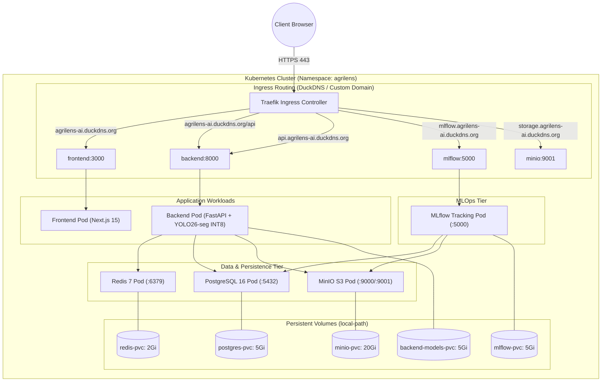

# AgriLens Kubernetes (K3s) Deployment Guide

Production-grade Kubernetes manifests for deploying the complete **AgriLens** end-to-end foliar leaf disease instance segmentation platform on **K3s** (lightweight Kubernetes) hosted on AWS EC2 (x86_64 or Graviton ARM64) or on-premises servers.

---

## 1. Architecture on Kubernetes



---

## 2. Directory Structure & Manifest Inventory

| Manifest | Kind | Description |
| :--- | :--- | :--- |
| **`namespace.yaml`** | `Namespace` | Dedicated `agrilens` isolated cluster namespace |
| **`secrets.yaml`** | `Secret` | Database credentials, JWT secret keys, and MinIO access tokens |
| **`pvc.yaml`** | `PersistentVolumeClaim` | 5 Persistent Volumes for PostgreSQL, Redis, MinIO, MLflow, and backend model caches |
| **`postgres.yaml`** | `Deployment` & `Service` | PostgreSQL 16 relational database with health probes |
| **`redis.yaml`** | `Deployment` & `Service` | Redis 7 caching and rate limiting server with AOF persistence |
| **`minio.yaml`** | `Deployment` & `Service` | MinIO S3 object storage (API port 9000, Web Console port 9001) |
| **`mlflow.yaml`** | `Deployment` & `Service` | Centralized MLflow experiment tracking server backed by MinIO artifact root |
| **`backend.yaml`** | `Deployment` & `Service` | FastAPI REST application with ONNX Runtime, Domain Guard, and memory limits |
| **`frontend.yaml`** | `Deployment` & `Service` | Next.js 15 AgriLens web application |
| **`cluster-issuer.yaml`**| `ClusterIssuer` | Let's Encrypt production ACME issuer for automated TLS certificates |
| **`ingress.yaml`** | `Ingress` | Traefik ingress rules with TLS termination for DuckDNS subdomains |

---

## 3. Deployment Walkthrough

### Step 1: Install K3s & Dependencies on Server
On your Ubuntu EC2 instance (`t3.large` or `c6i.large`):
```bash
# 1. Install K3s (Traefik ingress controller included by default)
curl -sfL https://get.k3s.io | sh -

# 2. Configure kubectl permissions
mkdir -p ~/.kube
sudo cp /etc/rancher/k3s/k3s.yaml ~/.kube/config
sudo chown $(id -u):$(id -g) ~/.kube/config
export KUBECONFIG=~/.kube/config

# 3. Install Cert-Manager for automatic SSL certificates
kubectl apply -f https://github.com/cert-manager/cert-manager/releases/download/v1.16.2/cert-manager.yaml
```

### Step 2: Configure DuckDNS Free Subdomain
1. Register a free subdomain at [DuckDNS](https://www.duckdns.org/) (e.g. `agrilens-ai.duckdns.org`).
2. Point the domain to your EC2 Public IP address.
3. Update `k8s/ingress.yaml` and `k8s/cluster-issuer.yaml` with your email and domain.

### Step 3: Deploy All Components
Apply manifests in chronological order:

```bash
# 1. Initialize namespace and secrets
kubectl apply -f k8s/namespace.yaml
kubectl apply -f k8s/secrets.yaml
kubectl apply -f k8s/pvc.yaml

# 2. Deploy persistence & MLOps services
kubectl apply -f k8s/postgres.yaml
kubectl apply -f k8s/redis.yaml
kubectl apply -f k8s/minio.yaml
kubectl apply -f k8s/mlflow.yaml

# Wait for databases to be ready
kubectl rollout status deployment/postgres -n agrilens
kubectl rollout status deployment/minio -n agrilens

# 3. Deploy Backend and Frontend applications
kubectl apply -f k8s/backend.yaml
kubectl apply -f k8s/frontend.yaml

# 4. Deploy Ingress and SSL Certificate Issuer
kubectl apply -f k8s/cluster-issuer.yaml
kubectl apply -f k8s/ingress.yaml
```

---

## 4. Verification & Health Monitoring

```bash
# Check status of all pods
kubectl get pods -n agrilens -o wide

# Check persistent volume claims
kubectl get pvc -n agrilens

# Check ingress status and assigned IP
kubectl get ingress -n agrilens

# Check TLS certificate issuance
kubectl get certificates -n agrilens

# Inspect backend logs
kubectl logs -n agrilens -l app=backend -f
```

---

## 5. Domain Ingress Endpoints

Once deployed and certificates are issued:

| Domain Endpoint | Target Service | Functionality |
| :--- | :--- | :--- |
| `https://agrilens-ai.duckdns.org` | `frontend:3000` | Main AgriLens diagnostic web application |
| `https://agrilens-ai.duckdns.org/api` | `backend:8000` | Same-origin API routing (prevents CORS) |
| `https://api.agrilens-ai.duckdns.org` | `backend:8000` | Standalone REST API & Swagger UI (`/docs`) |
| `https://mlflow.agrilens-ai.duckdns.org`| `mlflow:5000` | MLflow experiment tracking dashboard |
| `https://storage.agrilens-ai.duckdns.org`| `minio:9001` | MinIO S3 object storage management console |
